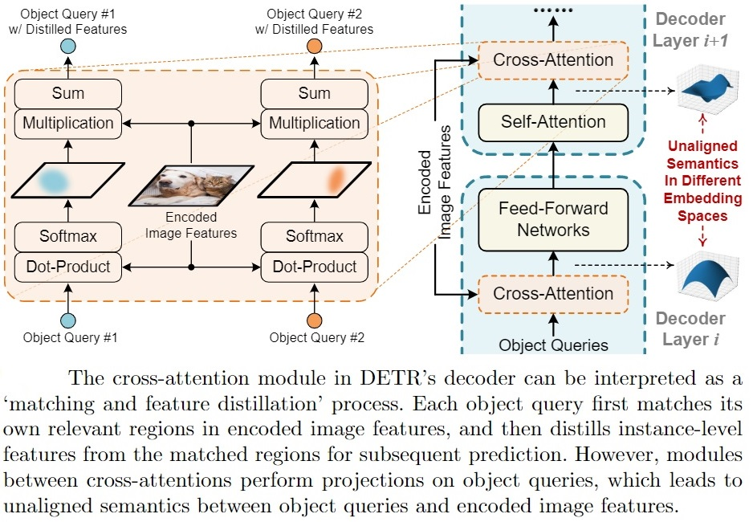
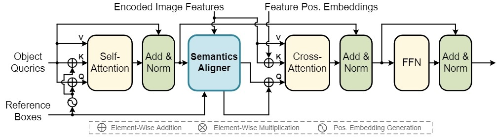
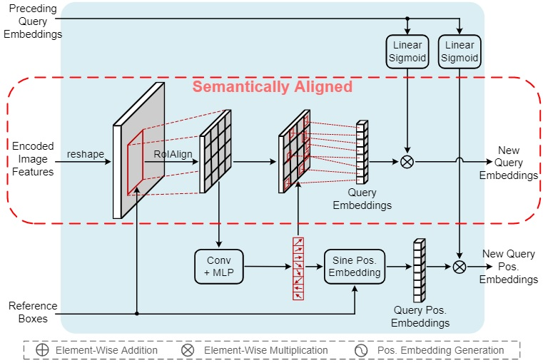

# SAM-DETR (Semantic-Aligned-Matching DETR)

This repository is an official PyTorch implementation of the
CVPR 2022 paper "[Accelerating DETR Convergence via Semantic-Aligned Matching](https://arxiv.org/abs/2203.06883)". 

## Introduction

<b> TL;DR </b> &nbsp; SAM-DETR is an efficeint DETR-like object detector that can
converge wihtin 12 epochs and outperform the strong Faster R-CNN (w/ FPN) baseline.

The recently developed DEtection TRansformer (DETR) has established a new
object detection paradigm by eliminating a series of hand-crafted components.
However, DETR suffers from extremely slow convergence, which increases the
training cost significantly. We observe that the slow convergence can be largely
attributed to the complication in matching object queries to encoded image features
in DETR's decoder cross-attention modules.

<div align=center>  

</div>

Motivated by this observation, in our paper, we propose SAM-DETR, a
Semantic-Aligned-Matching DETR that can greatly accelerates DETR's convergence
without sacrificing its accuracy. SAM-DETR addresses the slow convergence issue
from two perspectives. First, it projects object queries into the same
embedding space as encoded image features, where the matching can be accomplished
efficiently with aligned semantics. Second, it explicitly searches salient
points with the most discriminative features for semantic-aligned matching,
which further speeds up the convergence and boosts detection accuracy as well.
Being like a plug and play, SAM-DETR complements existing convergence solutions
well yet only introduces slight computational overhead. Experiments
show that the proposed SAM-DETR achieves superior convergence as well as
competitive detection accuracy.

At the core of SAM-DETR is a plug-and-play module named "Semantics Aligner" appended
ahead of the cross-attention module in each DETR's decoder layer. It also models a learnable
reference box for each object query, whose center location is used to generate
corresponding position embeddings.

<div align=center>  

</div>

The figure below illustrates the architecture of the appended "Semantics Aligner", which
aligns the semantics of "encoded image features" and "object queries" by resampling features 
from multiple salient points as new object queries.

<div align=center>  

</div>

Being like a plug-and-play, our approach can be
easily integrated with existing convergence solutions (*e.g.*, SMCA) in a complementary manner,
boosting detection accuracy and convergence speed further.

Please check [our CVPR 2022 paper](https://arxiv.org/abs/2203.06883) for more details.


## Installation

### Pre-Requisites
You must have NVIDIA GPUs to run the codes.

The implementation codes are developed and tested with the following environment setups:
- Linux
- 8x NVIDIA V100 GPUs (32GB)
- CUDA 10.1
- Python == 3.8
- PyTorch == 1.8.1+cu101, TorchVision == 0.9.1+cu101
- GCC == 7.5.0
- cython, pycocotools, tqdm, scipy

We recommend using the exact setups above. However, other environments (Linux, Python>=3.7, CUDA>=9.2, GCC>=5.4, PyTorch>=1.5.1, TorchVision>=0.6.1) should also work.

### Code Installation

First, clone the repository locally:
```shell
git clone https://github.com/ZhangGongjie/SAM-DETR.git
```

We recommend you to use [Anaconda](https://www.anaconda.com/) to create a conda environment:
```bash
conda create -n sam_detr python=3.8 pip
```

Then, activate the environment:
```bash
conda activate sam_detr
```

Then, install PyTorch and TorchVision:

(preferably using our recommended setups; CUDA version should match your own local environment)
```bash
conda install pytorch=1.8.1 torchvision=0.9.1 cudatoolkit=10.1 -c pytorch
```

After that, install other requirements:
```bash
conda install cython scipy tqdm
pip install -U 'git+https://github.com/cocodataset/cocoapi.git#subdirectory=PythonAPI'
```

<b>*[Optional]*</b> &nbsp;  If you wish to run multi-scale version of SAM-DETR (results not reported in the CVPR paper), you need to compile [*Deformable Attention*](https://github.com/fundamentalvision/Deformable-DETR),
which is used in DETR encoder to generate feature pyramid efficiently. If you don't need multi-scale
version of SAM-DETR, you may skip this step.
```bash
# Optionally compile CUDA operators of Deformable Attention for multi-scale SAM-DETR
cd SAM-DETR
cd ./models/ops
sh ./make.sh
python test.py  # unit test (should see all checking is True)
```

### Data Preparation

Please download [COCO 2017 dataset](https://cocodataset.org/) and organize them as following:

```
code_root/
└── data/
    └── coco/
        ├── train2017/
        ├── val2017/
        └── annotations/
        	├── instances_train2017.json
        	└── instances_val2017.json
```


## Usage

### Reproducing Paper Results

All scripts to reproduce results reported in [our CVPR 2022 paper](https://arxiv.org/abs/2203.06883)
are stored in ```./scripts```. We also provide scripts for slurm cluster,
which are stored in ```./scripts_slurm```.

Taking <b>SAM-DETR-R50 w/ SMCA (12 epochs)</b> for example, to reproduce its results, simply
run:
```shell
bash scripts/r50_smca_e12_4gpu.sh
```

Taking <b>SAM-DETR-R50 multiscale w/ SMCA (50 epochs)</b> for example, to reproduce its results on a slurm cluster, simply
run:
```shell
bash scripts_slurm/r50_ms_smca_e50_8gpu.sh
```

Reminder: To reproduce results, please make sure the total batch size matches the implementation details described in our paper. For ```R50 (single-scale)```
experiments, we use 4 GPUs with a batch size of 4 on each GPU. For ```R50 (multi-scale)```
experiments, we use 8 GPUs with a batch size of 2 on each GPU. For ```R50-DC5 (single-scale)```
experiments, we use 8 GPUs with a batch size of 1 on each GPU.


### Training
To perform training on COCO *train2017*, modify the arguments based on the scripts below:
```shell
python -m torch.distributed.launch \
    --nproc_per_node=4 \        # number of GPUs to perform training
    --use_env main.py \
    --batch_size 4 \            # batch_size on individual GPU (this is *NOT* total batch_size)
    --smca \                    # to integrate with SMCA, remove this line to disable SMCA
    --dilation \                # to enable DC5, remove this line to disable DC5
    --multiscale \              # to enable multi-scale, remove this line to disable multiscale
    --epochs 50 \               # total number of epochs to train
    --lr_drop 40 \              # when to drop learning rate
    --output_dir output/xxxx    # where to store outputs, remove this line for no storing outputs
```
More arguments and their explanations are available at ```main.py```.

### Evaluation
To evaluate a model on COCO *val2017*, simply add ```--resume``` and ```--eval``` arguments to your training scripts:
```shell
python -m torch.distributed.launch \
    --nproc_per_node=4 \
    --use_env main.py \
    --batch_size 4 \
    --smca \
    --dilation \                
    --multiscale \ 
    --epochs 50 \
    --lr_drop 40 \ 
    --resume <path/to/checkpoint.pth> \   # trained model weights
    --eval \                              # this means that only evaluation will be performed
    --output_dir output/xxxx   
```


## Model Zoo

*Trained model weights are stored in Google Drive.*

The original DETR models trained for 500 epochs:

<table>
  <thead>
    <tr style="text-align: right;">
      <th>Method</th>
      <th>Epochs</th>
      <th>Params (M)</th>
      <th>GFLOPs</th>
      <th>AP</th>
      <th>URL</th>
    </tr>
  </thead>
  <tbody>
    <tr>
      <td>DETR-R50</td>
      <td>500</td>
      <td>41</td>
      <td>86</td>
      <td>42.0</td>
      <td><a href="https://dl.fbaipublicfiles.com/detr/logs/detr-r50_log.txt">log</a></td>
    </tr>
    <tr>
      <td>DETR-R50-DC5</td>
      <td>500</td>
      <td>41</td>
      <td>187</td>
      <td>43.3</td>
      <td><a href="https://dl.fbaipublicfiles.com/detr/logs/detr-r50-dc5_log.txt">log</a></td>
    </tr>
  </tbody>
</table>


Our proposed SAM-DETR models (results reported in [our CVPR paper](https://arxiv.org/abs/2203.06883)):
<table>
  <thead>
    <tr style="text-align: right;">
      <th>Method</th>
      <th>Epochs</th>
      <th>Params (M)</th>
      <th>GFLOPs</th>
      <th>AP</th>
      <th>URL</th>
    </tr>
  </thead>
  <tbody>
    <tr>
      <td>SAM-DETR-R50</td>
      <td>12</td>
      <td>58</td>
      <td>100</td>
      <td>33.1</td>
      <td><a href="https://drive.google.com/file/d/1RXGs50nXkYBlYKFjI8nzt2ZDfLEVsLJZ/view?usp=sharing">model</a> <br/> <a href=".assets/output_logs/r50_e12.txt">log</a></td>
    </tr>
    <tr>
      <td>SAM-DETR-R50 w/ SMCA</td>
      <td>12</td>
      <td>58</td>
      <td>100</td>
      <td>36.0</td>
      <td><a href="https://drive.google.com/file/d/16ucFXgf0lrgzLArdmFzn3oOn3eGUrCU4/view?usp=sharing">model</a> <br/> <a href=".assets/output_logs/r50_smca_e12.txt">log</a></td>
    </tr>
    <tr>
      <td>SAM-DETR-R50-DC5</td>
      <td>12</td>
      <td>58</td>
      <td>210</td>
      <td>38.3</td>
      <td><a href="https://drive.google.com/file/d/18kZUCGLIQKerzcIlh_Hh87V3wUkrTwEu/view?usp=sharing">model</a> <br/> <a href=".assets/output_logs/r50_dc5_e12.txt">log</a></td>
    </tr>
    <tr>
      <td>SAM-DETR-R50-DC5 w/ SMCA</td>
      <td>12</td>
      <td>58</td>
      <td>210</td>
      <td>40.6</td>
      <td><a href="https://drive.google.com/file/d/1gDfRo1DEv43d6DUMF1n_Lzv2lkRv0huE/view?usp=sharing">model</a> <br/> <a href=".assets/output_logs/r50_dc5_smca_e12.txt">log</a></td>
    </tr>
    <tr>
      <td>SAM-DETR-R50</td>
      <td>50</td>
      <td>58</td>
      <td>100</td>
      <td>39.8</td>
      <td><a href="https://drive.google.com/file/d/11BZHGv2UAtqECX10MZ3VMS81RqGQM5Aq/view?usp=sharing">model</a> <br/> <a href=".assets/output_logs/r50_e50.txt">log</a></td>
    </tr>
    <tr>
      <td>SAM-DETR-R50 w/ SMCA</td>
      <td>50</td>
      <td>58</td>
      <td>100</td>
      <td>41.8</td>
      <td><a href="https://drive.google.com/file/d/1XHDkMsVB-zncVRsf21Z1-hPxJJCi7TGN/view?usp=sharing">model</a> <br/> <a href=".assets/output_logs/r50_smca_e50.txt">log</a></td>
    </tr>
    <tr>
      <td>SAM-DETR-R50-DC5</td>
      <td>50</td>
      <td>58</td>
      <td>210</td>
      <td>43.3</td>
      <td><a href="https://drive.google.com/file/d/1XYLr3yhqmmT3RWIJ_4SN1S-bO4BtWgcX/view?usp=sharing">model</a> <br/> <a href=".assets/output_logs/r50_dc5_e50.txt">log</a></td>
    </tr>
    <tr>
      <td>SAM-DETR-R50-DC5 w/ SMCA</td>
      <td>50</td>
      <td>58</td>
      <td>210</td>
      <td>45.0</td>
      <td><a href="https://drive.google.com/file/d/1q_iWQOZl1zXtaVD4vI4V9piwj2tkE8ek/view?usp=sharing">model</a> <br/> <a href=".assets/output_logs/r50_dc5_smca_e50.txt">log</a></td>
    </tr>
  </tbody>
</table>


Our proposed multi-scale SAM-DETR models (results to appear in a journal extension):
<table>
  <thead>
    <tr style="text-align: right;">
      <th>Method</th>
      <th>Epochs</th>
      <th>Params (M)</th>
      <th>GFLOPs</th>
      <th>AP</th>
      <th>URL</th>
    </tr>
  </thead>
  <tbody>
    <tr>
      <td>SAM-DETR-R50-MS</td>
      <td>12</td>
      <td>55</td>
      <td>203</td>
      <td>41.1</td>
      <td><a href="https://drive.google.com/file/d/1Rdp7QngEaS0mxRQoxq7pGUM7LkZtgyzx/view?usp=sharing">model</a> <br/> <a href=".assets/output_logs/r50_ms_e12.txt">log</a></td>
    </tr>
    <tr>
      <td>SAM-DETR-R50-MS w/ SMCA</td>
      <td>12</td>
      <td>55</td>
      <td>203</td>
      <td>42.8</td>
      <td><a href="https://drive.google.com/file/d/12xJJA-8P1YPfW3wp3l2aMdkQX_mCAOR5/view?usp=sharing">model</a> <br/> <a href=".assets/output_logs/r50_ms_smca_e12.txt">log</a></td>
    </tr>
    <tr>
      <td>SAM-DETR-R50-MS</td>
      <td>50</td>
      <td>55</td>
      <td>203</td>
      <td>46.1</td>
      <td><a href="pending">model</a> <br/> <a href=".assets/output_logs/r50_ms_e50.txt">log</a></td>
    </tr>
    <tr>
      <td>SAM-DETR-R50-MS w/ SMCA</td>
      <td>50</td>
      <td>55</td>
      <td>203</td>
      <td>47.1</td>
      <td><a href="https://drive.google.com/file/d/1yZHRDxa3eVvgDBBEwpCbsm_yqShEV3cC/view?usp=sharing">model</a> <br/> <a href=".assets/output_logs/r50_ms_smca_e50.txt">log</a></td>
    </tr>
  </tbody>
</table>

Note:
1. AP is computed on *COCO val2017*.
2. "DC5" means removing the stride in C5 stage of ResNet and add a dilation of 2 instead.
3. The GFLOPs of our models are estimated using [fvcore](https://github.com/facebookresearch/fvcore) on the first 100 images in *COCO val2017*. GFLOPs varies as input image sizes change. There may exist slight difference from actual values.


## License

The implementation codes of SAM-DETR are released under the MIT license.

Please see the [LICENSE](LICENSE) file for more information.

However, prior works' licenses also apply. It is your responsibility to ensure you comply with all license requirements.

## Citation

If you find SAM-DETR useful or inspiring, please consider citing:

```bibtex
@inproceedings{zhang2022-SAMDETR,
  title      = {Accelerating {DETR} Convergence via Semantic-Aligned Matching},
  author     = {Zhang, Gongjie and Luo, Zhipeng and Yu, Yingchen and Cui, Kaiwen and Lu, Shijian},
  booktitle  = {Proceedings of the IEEE/CVF Conference on Computer Vision and Pattern Recognition (CVPR)},
  year       = {2022}
}
```


## Acknowledgement

Our SAM-DETR is heavily inspired by many outstanding prior works, including [DETR](https://github.com/facebookresearch/detr), [Conditional-DETR](https://github.com/Atten4Vis/ConditionalDETR), 
[SMCA-DETR](https://github.com/gaopengcuhk/SMCA-DETR), and [Deformable DETR](https://github.com/fundamentalvision/Deformable-DETR).
Thank the authors of above projects for open-sourcing their implementation codes!
